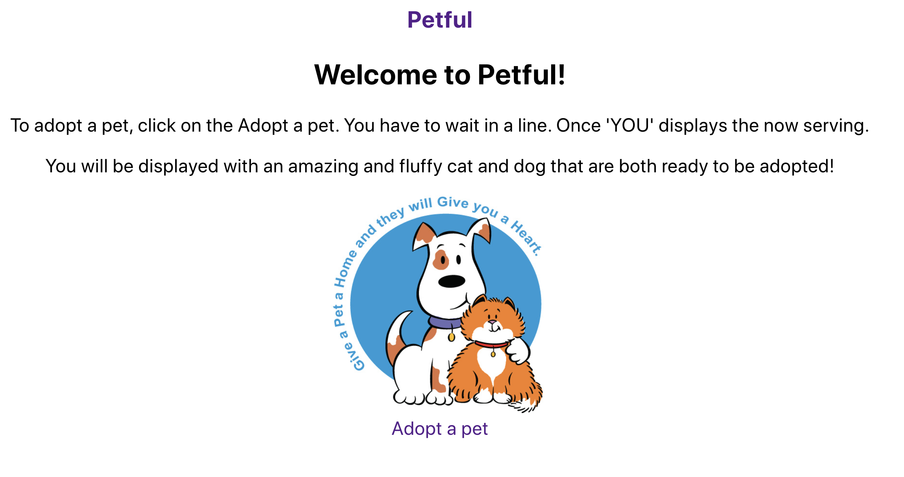
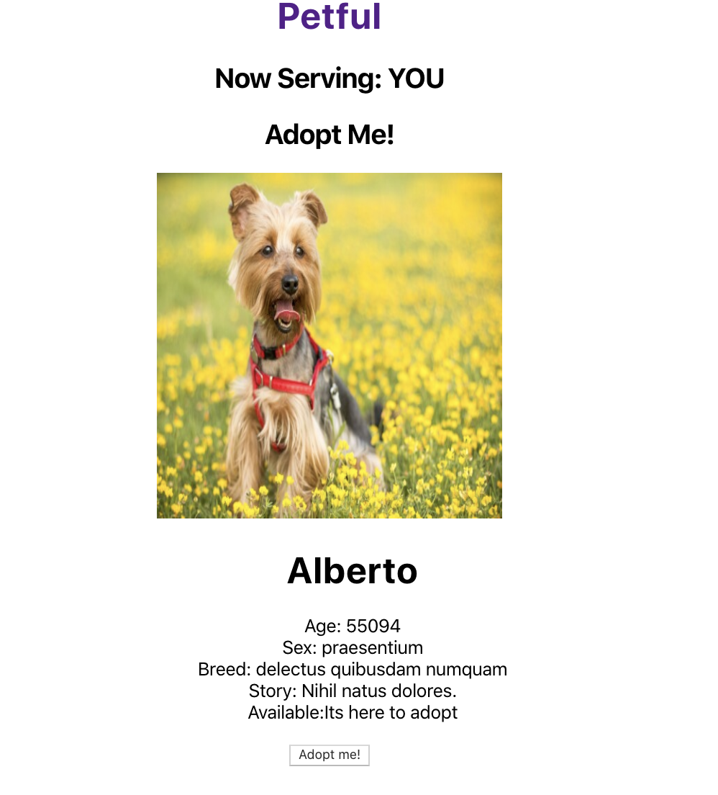

## Petful 

### Teammate: Kevin Wei && Smiti Shakya

Live App: https://petful-client-amber-ten.now.sh/

## User Stories
**Landing Page:**
  - [ ] It has a description of the adoption process.
  - [ ] It has a meaningful picture that matches its description.
  - [ ] It has a button to start the adoption process.

**Adoption Page:**
- Available Pets:
  - [ ] I should be able to only see the pet that is next in line to be adopted.
  - [ ] If there are other pets in line I could see them but I should not be able to adopt them other than the one next in line to be adopted.
- Place in Line:
  - [ ] I should be able to see my place in line and anyone else who is in the line before me.
  - [ ] I should not be able to start the adoption process unless it is my turn.
- Unavailable Pets:
  - [ ] I should be able to see the pets that have been adopted by other pet lovers and removed from the shelter.
  - [ ] I should no longer be able to adopt pets that have been removed.

### Summary

Petful is an app to adopt a pet from animal shelter. Users have to wait in line to adopt
a pet. Once the turn comes, they can pick any
pets from the available pets to take home.  

## Technologies

- React
- CSS
- Zeit 
